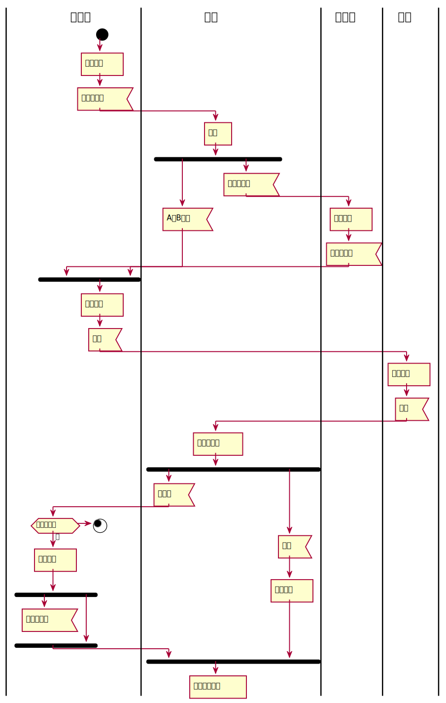
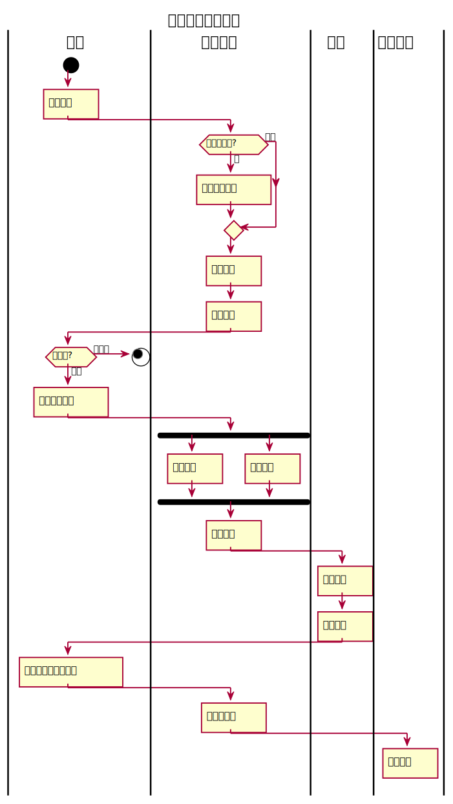

# 流程图1：考试及成绩管理流程
### PlantUML源码如下：

```$xslt
@startuml
|教务处|
start
    :安排考试]
    :考试安排表<
|教师|
    :出卷]
    fork
    :A、B试卷<
    fork again
    :打印审批表<
|系主任|
    :审批签字]
    :打印审批表<

|教务处|
    end fork
    :打印试卷]
    :试卷<
|学生|
    :参加考试]
    :答卷<
|教师|
    :阅卷出成绩]
    fork
    :成绩单<
|教务处|
    if(有不及格？)
        stop
    else(是)
        :安排补考]
        fork
        :补考安排表<
        detach
        fork again
        end fork
    endif
|教师|
    fork again
    :答卷<
    :装订存档]
    end fork
:期末流程结束]
@enduml

```


### 考试及成绩管理流程图：



# 流程图2：客户维修服务流程
### PlantUML源码如下：
```$xslt
@startuml
|客户|
    start
    title 客户维修服务流程
    :申请服务]

|业务经理|
    if (是新客户吗?) then (是)
        :登记客户信息]
    else (不是)
    endif
    :上门勘察]
    :制定方案]

|客户|
    if (满意吗?) then  (不满意)
    stop
    else (满意)
       :签订服务合同]
       |业务经理|
       fork
       :安排工人]
       fork again
       :安排材料]
       end fork
       :派写工单]
       |工人|
       :领取材料]
       :上门服务]
       |客户|
       :验收并填写反馈意见]
       |业务经理|
       :交回派工单]
       |财务人员|
       :结算收款]
       detach
    endif
@enduml
```

### 客户维修服务流程图

