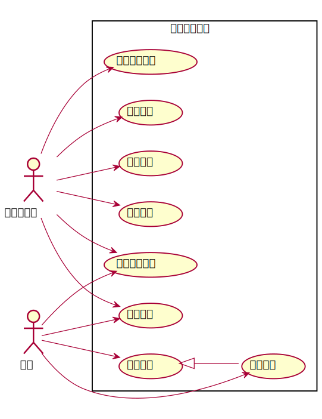

# 实验2：图书管理系统用例建模
|学号|班级|姓名|照片|
|:-------:|:-------------: | :----------:|:---:|
|201710414325|软件(本)17-3|袁鑫|...|

## 1. 图书管理系统的用例关系图

### 1.1 用例图PlantUML源码如下：

```
@startuml
left to right direction
skinparam packageStyle rectangle
actor 读者
actor 图书管理员
rectangle 图书管理系统 {
  读者 -> (查询书目)
  读者 --> (查询借阅情况)
  读者 --> (预定图书)
  读者 --> (取消预订)
  图书管理员 --> (借出图书)
  图书管理员 --> (归还图书)
  图书管理员 --> (维护书目)
  图书管理员 --> (维护读者信息)
  图书管理员 --> (查询书目)
  图书管理员 --> (查询借阅情况)
  (预定图书) <|-- (取消预订)
}
@enduml
```
### 1.2. 用例图如下：

## 2. 参与者说明：

###     2.1 图书管理员

主要职责是：借出图书;归还图书;维护书目;维护读者信息

###     2.2 读者

主要职责是：查询书目;查询借阅情况;预定图书;取消预订
##     3. 用例规约表

###     3.1 “借出图书”用例
[usecase1.md](usecase1.md)
###     3.2 “归还图书”用例
[usecase2.md](usecase2.md)
###     3.3 “维护书目”用例
[usecase3.md](usecase3.md)
###     3.4 “维护读者信息”用例
[usecase4.md](usecase4.md)
###     3.5 “查询书目”用例
[usecase5.md](usecase5.md)
###     3.6 “查询借阅情况”用例
[usecase6.md](usecase6.md)
###     3.7 “预定图书”用例
[usecase7.md](usecase7.md)
###     3.8 “取消预订”用例
[usecase8.md](usecase8.md)
