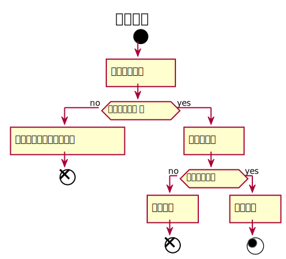

###1. 借出图书用例
#### 借出图书用例规约：
|  用例名称 |      借出图书  |
|:-------|:-------------|
|  参与者 |      图书管理员  |
|前置条件|用户发出借书请求 |
|后置条件|更新图书与用户借书记录信息 |
|主事件流|图书管理员获得相应图书的信息<br>图书管理员更新读者借阅信息<br>图书管理员更新图书库存信息 |


#### 借出图书用例流程图PlantUML源码：
```
@startuml
title 借出图书
start
	:输入图书名称]
	if (图书是否收录 ？) then (no)
		:输入有误，该图书未收录]
		end
	else (yes)
		:显示库存量]
	if (库存量充足？) then (no)
		:借阅失败]
		end
	else (yes)
		:借阅成功]
stop
@enduml
```
#### 借出图书用例流程图：
