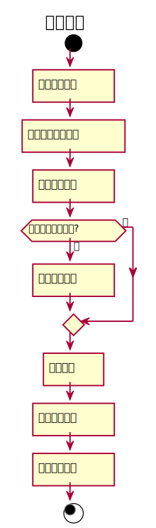

### 2. 归还图书用例
#### 归还图书用例规约：
|  用例名称 |      归还图书  |
|:-------|:------------- |
|  参与者 |      图书管理员  |
|前置条件|用户发出还书请求 |
|后置条件|更新图书与用户借书记录信息 |
|主事件流|图书管理员获得相应图书的信息<br>图书管理员查询是否逾期<br>图书管理员更新读者借阅信息<br>图书管理员更新图书库存信息 |


#### 归还图书用例流程图PlantUML源码：
```
@startuml
title 归还图书
start
:归还图书信息]
:查看借阅记录信息]
:获取借书时间]
if (归还日期是否逾期?) then (是)
    :需要缴纳罚款]
else (否)
endif
    :还书成功]
    :更新图书信息]
    :更新用户信息]
stop
@enduml
```
#### 归还图书用例流程图：
