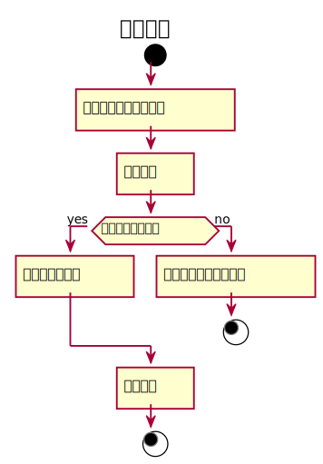

###3. 维护图书用例
#### 维护图书用例规约：
|  用例名称 |      维护图书用例  |
|:-------|:-------------|
|  参与者 |      图书管理员  |
|前置条件|到达图书维护周期或新图书加入 |
|后置条件|提示是否成功<br>更新图书信息 |
|主事件流|图书管理员获得相应图书的信息<br>图书管理员更新图书信息 |


#### 维护图书用例流程图PlantUML源码：
```
@startuml
 title 维护图书
 start
     :输入所需要维护的图书]
     :维护书目]
 if(是否有书目信息？) then (yes)
     :填写书目新信息]
 else (no)
     :提示无该图书书目信息]
 stop
 endif
     :更新信息]
 stop
 @enduml
```
#### 维护图书用例流程图：
