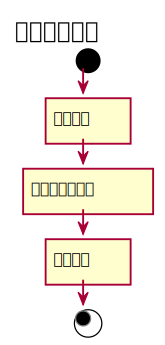

###4. 维护读者信息用例
#### 维护读者信息用例规约：
|  用例名称 |      维护读者信息  |
|:-------|:-------------|
|  参与者 |      图书管理员  |
|前置条件|读者信息发生变更 |
|后置条件|更新读者信息 |
|主事件流|图书管理员获得读者信息变更的信息<br>图书管理员更新读者信息<br>提示更新成功 |


#### 维护读者信息流程图PlantUML源码：
```
@startuml
title 维护读者信息
start

    :选择读者]
    :填写读者新信息]
    :更新信息]
stop
@enduml
```
#### 维护读者信息流程图：
