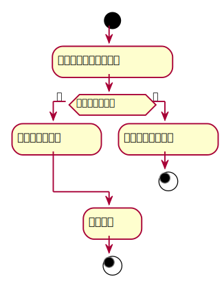

### 5. 查询书目用例
#### 查询书目用例规约：
|  用例名称 |      查询书目  |
|:-------|:-------------|
|  参与者 |      图书管理员,读者  |
|前置条件|点击查阅图书 |
|后置条件|显示相应图书信息 |
|主事件流|根据查询信息显示相应的图书信息|


#### 查询书目用例流程图PlantUML源码：
```
@startuml 
start   
    :输入所需要查询的图书; 
if(是否有该图书？) then (是) 
    :显示该图书信息; 
else (否) 
    :提示不存在该图书; 
stop 
endif 
    :查看图书; 
stop
@enduml 
```
#### 查询书目用例流程图：
