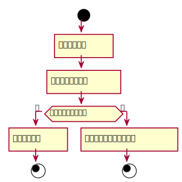

### 6. 查询借阅情况用例
#### 查询借阅情况用例规约：
|  用例名称 |      查询借阅情况  |
|:-------|:-------------|
|  参与者 |      图书管理员,读者  |
|前置条件|点击查阅借阅情况 |
|后置条件|显示相应借阅情况 |
|主事件流|根据相应用户显示相应的借阅情况|


#### 查询借阅情况用例流程图PlantUML源码：
```
@startuml
start
    :查询借阅情况]
    :列出读者借阅信息]
if(是否存在借阅信息？) then (是)
    :显示借阅信息]
stop
else (否)
    :提示不存在任何借阅信息]
stop

@enduml
```
#### 查询借阅情况用例流程图：
