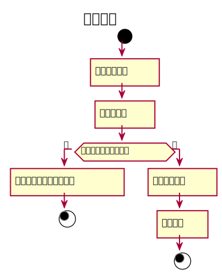

### 7. 预约图书用例
#### 预约图书用例规约：
|  用例名称 |      预约图书用例  |
|:-------|:-------------|
|  参与者 |      读者  |
|前置条件|点击预约图书 |
|后置条件|提示预约信息 |
|主事件流|查询是否存在库存<br>返回预约信息|


#### 预约图书用例流程图PlantUML源码：
```
@startuml
title 预约图书
start
    :选择预约图书]
    :填写预定单]
if(该图书是否还有库存？) then (是)
    :可以直接借阅，无需预约]
stop
else (否)
    :确认预约信息]
    :预约成功]
stop
@enduml
```
#### 预约图书用例流程图：
