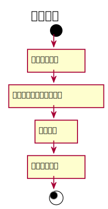

### 8. 取消预约用例用例
#### 取消预约用例规约：
|  用例名称 |      取消预约  |
|:-------|:-------------|
|  参与者 |      读者  |
|前置条件|已有预约信息 |
|后置条件|更新预约信息 |
|主事件流|查询预约信息<br>更新预约信息|


#### 取消预约用例流程图PlantUML源码：
```
@startuml
title 取消预约
start
    :查看预约订单]
    :选择取消图书的预约订单]
    :取消预约]
    :预约订单更新]
stop
@enduml
```
#### 取消预约用例流程图：
