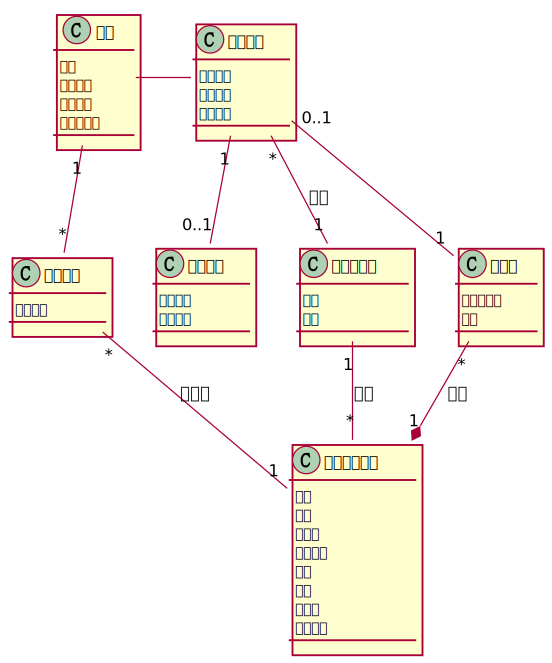
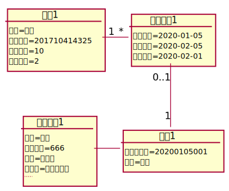
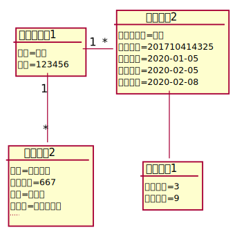

# 实验3：图书管理系统领域对象建模
|学号|班级|姓名|照片|
|:-------:|:-------------: | :----------:|:---:|
|201710414325|软件(本)17-3|袁鑫|...|

## 1. 图书管理系统的类图

### 1.1 类图PlantUML源码如下：

```
@startuml
class 读者{
姓名
借书卡号
图书限额
已借图书数
}
class 借阅记录{
借书日期
应还日期
还书日期
}
class 预定记录{
预定日期
}
class 逾期记录{
逾期天数
应缴罚款
}
class 图书管理员{
姓名
工号
}
class 资源项{
馆藏流水号
状态
}

class 馆藏图书品种{
书名
作者
出版社
出版日期
价格
简介
总数量
可借数量
}
读者 - 借阅记录
读者 "1"--"*" 预定记录
借阅记录 "0..1"--"1" 资源项
借阅记录 "1"--"0..1" 逾期记录
借阅记录 "*"--"1" 图书管理员:登记
图书管理员 "1"--"*" 馆藏图书品种:管理
预定记录 "*"--"1" 馆藏图书品种:被预定
资源项 "*"--*"1" 馆藏图书品种:拥有
@enduml
```

### 1.2. 类图如下：





## 2. 图书管理系统的对象图
### 2.1 类读者的对象图
#### 源码如下：
``` 
@startuml
object 读者1{
姓名=袁鑫
借书卡号=201710414325
借书限额=10
可用限额=2
}
object 借阅记录1{
借书日期=2020-01-05
应还日期=2020-02-05
还书日期=2020-02-01
}

object 图书1{
馆藏流水号=20200105001
状态=借出
}

object 图书品种1{
书名=三体
国际书号=666
作者=刘慈欣
出版社=歌者出版社
....
}

读者1 "1"-"*" 借阅记录1
借阅记录1 "0..1"--"1" 图书1
图书1 -left- 图书品种1

@enduml
``` 
#### 对象图如下：


### 2.2 类图书管理员的对象图
#### 源码如下：
``` 
@startuml
object 图书管理员1{
姓名=楚风
工号=123456
}
object 借阅记录2{
借阅人姓名=袁鑫
借书卡号=201710414325
借书日期=2020-01-05
应还日期=2020-02-05
还书日期=2020-02-08
}
object 逾期记录1{
逾期天数=3
应缴罚款=9
}

object 图书品种2{
书名=流浪地球
国际书号=667
作者=刘慈欣
出版社=歌者出版社
....
}
图书管理员1 "1"-"*" 借阅记录2
借阅记录2 -- 逾期记录1
图书管理员1 "1"--"*" 图书品种2
@enduml
``` 
#### 对象图如下：
