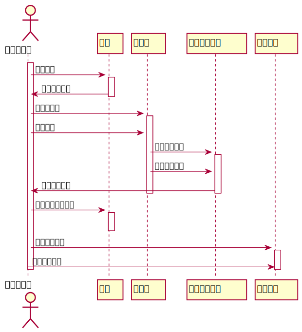
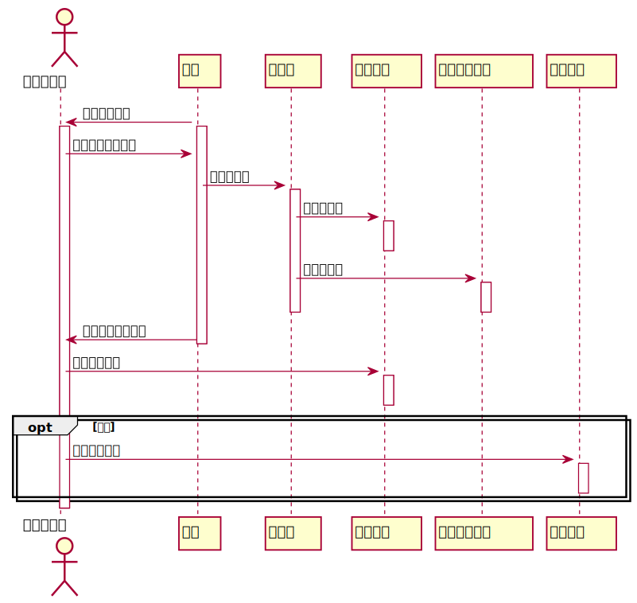

# 实验4：图书管理系统顺序图绘制
|学号|班级|姓名|照片|
|:-------:|:-------------: | :----------:|:---:|
|201710414325|软件(本)17-3|袁鑫|...|

## 图书管理系统的顺序图

## 1. 借书用例
## 1.1. 借书用例PlantUML源码

``` sequence
@startuml
actor 图书管理员

activate 图书管理员
图书管理员 -> 读者:验证读者
activate 读者
读者 -> 图书管理员:返回读者信息

deactivate 读者

图书管理员 -> 资源项:获取资源项
activate 资源项
图书管理员 -> 资源项:借出资源


资源项 -> 馆藏图书品种:查找资源品种
activate 馆藏图书品种
资源项 -> 馆藏图书品种:减少可借数量
馆藏图书品种 -> 图书管理员:返回资源信息
deactivate 馆藏图书品种
deactivate 资源项
图书管理员 -> 读者:更改读者借书限额
activate 读者
deactivate 读者
图书管理员 -> 借阅记录:创建借阅记录
activate 借阅记录
图书管理员 -> 借阅记录:打印借书清单
deactivate 借阅记录
deactivate 图书管理员
@enduml
```

## 1.2. 借书用例顺序图


## 1.3. 借书用例顺序图说明
1.图书管理员验证读者信息  
2.查找到要借阅的图书，并数量减1  
3.减少读者的借阅限额  
4.创建借阅记录，打印借书清单

***

## 2. 还书用例
## 2.1. 还书用例PlantUML源码

``` sequence
@startuml
actor 图书管理员

读者 -> 图书管理员:发送还书请求
activate 图书管理员
activate 读者
图书管理员 -> 读者:读取读者借阅信息
读者 -> 资源项:获取资源项
activate 资源项
资源项 -> 借阅记录:取借阅记录
activate 借阅记录
deactivate 借阅记录
资源项 -> 馆藏图书品种:取图书品种
activate 馆藏图书品种
deactivate 馆藏图书品种
deactivate 资源项
读者 -> 图书管理员:返回借阅相关信息
deactivate 读者

图书管理员 -> 借阅记录:登记还书日期
activate 借阅记录
deactivate 借阅记录
opt 逾期
图书管理员 -> 逾期记录:登记逾期记录
activate 逾期记录
deactivate 逾期记录
end

deactivate 图书管理员
@enduml
```

## 2.2. 还书用例顺序图


## 2.3. 还书用例顺序图说明
1.读者发送还书请求  
2.图书管理员开始获取相关借书信息  
3.返回借书相关信息  
4.登记还书日期，查看是否逾期
***