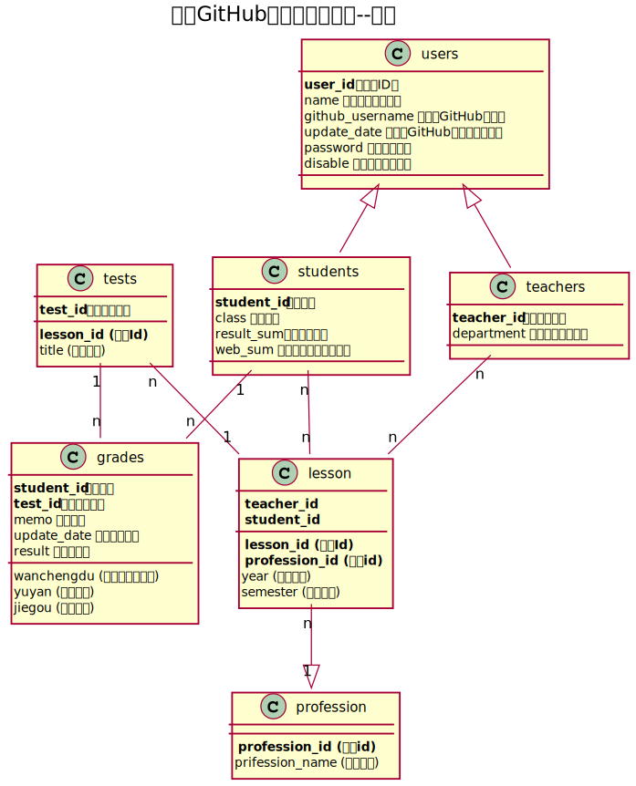

# 基于GitHub的实验管理平台的分析与设计

### 成都大学信息科学与工程学院

|学号|班级|姓名|照片|
|:-------:|:-------------: | :----------:|:---:|
|201710414325|软件(本)17-3|袁鑫|...|

## 1. 概述
- 基于GitHub的实验管理平台的作用是在线管理实验成绩的Web应用系统。学生和老师的实验内容均存放在GitHUB
页面上
- 用户的功能主要有：登录登出，查看信息，修改信息，修改密码。
- 学生的功能主要有：设置自己的GitHub用户名，选择课程，查询自己的实验成绩。学生的GitHub用户名是公开的，但成绩不公开。
- 老师的功能主要有：选择课程（优先于学生），批改每个学生的成绩，查看每个学生的成绩。
- 老师和学生都能通过本系统的链接方便地跳转到学生的每个GitHUB实验目录，以便批改实验或者查看实验情况。
- 实验成绩按数字分数计算，分为多个评分项：内容是否完整（50分），语言简洁准确（25分），结构严谨清晰（25分）。
- 系统自动计算每个学生的所有实验的平均分。
    
## 2. 系统总体结构

    
## 3. 用例图设计 [用例图源码](src/yongli.puml)

## 4. 类图设计 [类图源码](src/class.puml)

## 5. 数据库设计
- ### [参见数据库设计](database/database.md)

## 6. 用例及界面详细设计
- ### [“登录”用例](./usecase/login.md),[界面](https://zwdcdu.github.io/is_analysis/test6/ui/登录.html)
- ### [“登出”用例](./usecase/logout.md),[界面](https://zwdcdu.github.io/is_analysis/test6/ui/顶部菜单.html)
- ### [“老师选课”用例](./usecase/teach.md)
- ### [“学生选课”用例](./usecase/lesson.md)
- ### [“学生列表”用例](./usecase/studentlist.md),[界面](https://zwdcdu.github.io/is_analysis/test6/ui/index.html)
- ### [“评定成绩”用例](./usecase/dafen.md),[界面](https://zwdcdu.github.io/is_analysis/test6/ui/评定成绩.html)
- ### [“查看成绩”用例](./usecase/grades.md),[界面](https://zwdcdu.github.io/is_analysis/test6/ui/查看成绩.html)
- ### [“修改密码”用例](./usecase/password.md),[界面](https://zwdcdu.github.io/is_analysis/test6/ui/顶部菜单.html)
- ### [“修改用户信息”用例](./usecase/update.md),[界面](https://zwdcdu.github.io/is_analysis/test6/ui/顶部菜单.html)
- ### [“查看用户信息”用例](./usecase/yonghu.md),[界面](https://zwdcdu.github.io/is_analysis/test6/ui/顶部菜单.html)

