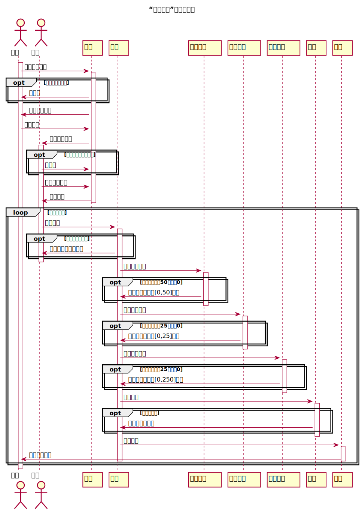

# “评定成绩”用例 [返回](../README.md)
## 1. 用例规约

<table>
    <caption>“评阅实验”用例规约</caption>
    <tr>
        <td>用例名称</td>
        <td>评阅实验</td>
    </tr>
    <tr>
        <td>参与者</td>
        <td>教师</td>
    </tr>
    <tr>
        <td>前置条件</td>
        <td>教师已登录，并进入课程实验页面，获取到学生列表</td>
    </tr>
    <tr>
        <td>后置条件</td>
        <td>系统跳转至实验的学生列表页面</td>
    </tr>
    <tr>
        <td colspan="2">主事件流</td>
                <td>
                    1. 教师选择学生； 
                    2. 系统验证教师登录状态是否有效； 
                    3. 系统跳转至实验评分页面； 
                    4. 教师填写实验的内容完成度分数； 
                    5. 教师填写实验的语言分数； 
                    6. 教师填写实验的结构清晰分数； 
                    7.教师填写对该实验的评语； 
                    8.教师点击提交按钮； 
                    9.系统将各评分项成绩相加得实验成绩； 
                    10.系统存储实验成绩与评语； 
                    11.系统提示评阅实验成绩成功。
                </td>
    </tr>
    <tr>
        <td colspan="2">备选事件流</td>
                <td colspan="2">
                    2a. 系统验证教师登录状态已失效 
                        &nbsp&nbsp&nbsp&nbsp&nbsp&nbsp
                        1. 系统提示验证教师登录状态失败，转第1步； 
                    8a.教师选择返回，放弃评阅结构分数 
                        &nbsp&nbsp&nbsp&nbsp&nbsp&nbsp
                        1. 系统跳转至实验的学生列表页面，转第1步； 
                </td>
    </tr>
</table>

## 2. 业务流程（顺序图） [源码](../src/dafen.puml)
 

    
## 3. 界面设计
- 界面参照: [界面](https://qtfy1005050140.github.io/is_analysis_pages/ui2/dafen.html)

- API接口调用

    - 接口1：[getNextPrevStudent](../api/getNextPrevStudent.md)
        
        用于取得上一个或者下一个学生的学号
        
    - 接口2：[getOneStudentResults](../api/getOneStudentResults.md)
        
        用于显示一个学生的所有实验成绩和评语
         
    - 接口3：[setOneStudentResults](../api/setOneStudentResult.md)
    
        用于设置一个学生的部分实验成绩和评语

    
## 4. 参照表

- [table_student](../database/database.md)
- [table_grades](../database/database.md)
- [table_test](../database/database.md)