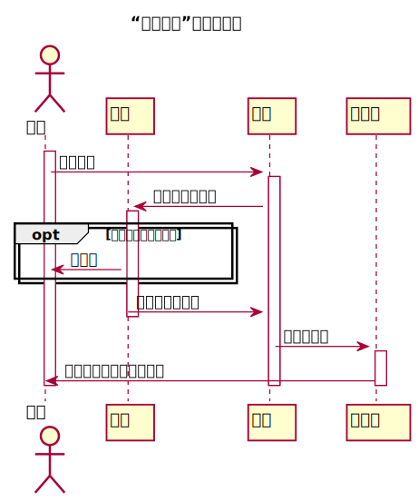

# “查看成绩”用例 [返回](../README.md)
## 1. 用例规约

|用例名称|查看成绩|
|-------|:-------------|
|功能|学生查看自己的每个实验的实验成绩及实验评价|
|参与者|学生|
|前置条件|学生需要先登录|
|后置条件| |
|主事件流| 点击查看自己的成绩|
|备选事件流| |

## 2. 业务流程（顺序图） [源码](../src/grades.puml)
 

## 3. 界面设计
- 界面参照: [界面](https://qtfy1005050140.github.io/is_analysis_pages/ui2/top.html)
- API接口调用
    - 接口1：[getOneStudentResults](../api/getOneStudentResults.md) 

    
## 4. 参照表
- [table_student](../database/database.md)
- [table_grades](../database/database.md)
- [table_test](../database/database.md)
