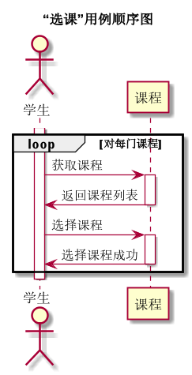

# “学生选课”用例 [返回](../README.md)
## 1. 用例规约

<table>
    <caption>“学生选课”用例规约</caption>
    <tr>
        <td>用例名称</td>
        <td>学生选课</td>
    </tr>
    <tr>
        <td>参与者</td>
        <td>学生</td>
    </tr>
    <tr>
        <td>前置条件</td>
        <td>学生已登录，老师已选课</td>
    </tr>
    <tr>
        <td>后置条件</td>
        <td>系统跳转至实验管理平台首页</td>
    </tr>
    <tr>
        <td colspan="2">主事件流</td>
                <td>
                    1. 学生点击选课按钮； 
                     2. 系统验证学生登录状态是否有效； 
                     3. 系统检索能够被学生选择的课程； 
                     4. 系统返回课程列表； 
                     5. 系统跳转至选课页面； 
                     6. 学生选择课程； 
                     7. 学生点击提交按钮；
                     8. 系统存储学生选择的课程； 
                     9. 系统提示选课成功。      
                </td>
    </tr>
    <tr>
        <td colspan="2">备选事件流</td>
                <td colspan="2">
                    2a. 系统验证学生登录状态已失效 
                        &nbsp&nbsp&nbsp&nbsp&nbsp&nbsp
                        1. 系统提示验证学生登录状态失败，转第1步； 
                    4a. 系统未能检索到能够被学生选择的课程 
                        &nbsp&nbsp&nbsp&nbsp&nbsp&nbsp
                        1. 系统提示无可选课程，转第1步； 。
                </td>
    </tr>
</table>

## 2. 业务流程（顺序图） [源码](../src/lesson.puml)
 

    
## 3. 界面设计
- 界面参照: https://zwdcdu.github.io/is_analysis/test6/ui/评定成绩.html

- API接口调用

    - 接口1：[chooseLesson](../api/chooseLesson.md)
        
        学生选课
        

    
## 4. 参照表
- [table_lesson](../database/database.md)
- [table_student](../database/database.md)
- [table_test](../database/database.md)