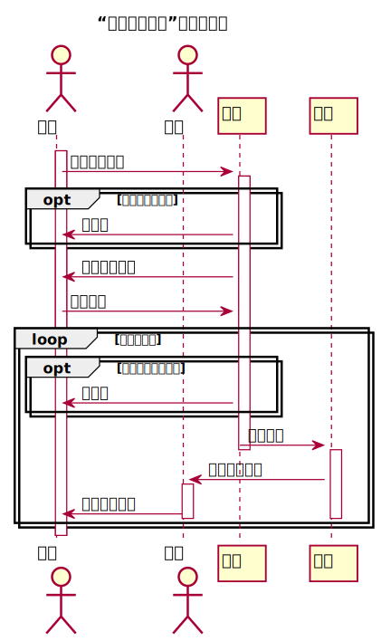

# “学生列表”用例 [返回](../README.md)
## 1. 用例规约

<table>
    <caption>“查看学生列表”用例规约</caption>
    <tr>
        <td>用例名称</td>
        <td>查看学生列表</td>
    </tr>
    <tr>
        <td>参与者</td>
        <td>教师，学生</td>
    </tr>
    <tr>
        <td>前置条件</td>
        <td>教师，学生已登录</td>
    </tr>
    <tr>
        <td>后置条件</td>
        <td>系统跳转至实验的学生列表页面</td>
    </tr>
    <tr>
        <td colspan="2">主事件流</td>
                <td>
                    1. 点击获取学生列表按钮并选择课程；
                           
                                2. 系统验证登录状态是否有效； 
                                3. 系统检索该课程的所有学生列表； 
                                4. 系统返回课程的所有学生列表。</td>
    </tr>
    <tr>
        <td colspan="2">备选事件流</td>
                <td colspan="2">
                    2a. 系统验证登录状态已失效 
                        &nbsp&nbsp&nbsp&nbsp&nbsp&nbsp
                        1. 系统提示验证教师登录状态失败，转第1步； 
                    3a. 系统未检索到参加该课程的学生 
                        &nbsp&nbsp&nbsp&nbsp&nbsp&nbsp
                        1. 系统提示未检索到学生，转第1步； 
    </tr>
</table>

## 2. 业务流程（顺序图） [源码](../src/studentlist.puml)
 

## 3. 界面设计
- 界面参照: https://zwdcdu.github.io/is_analysis/test6/ui/index.html
- API接口调用
    - 接口1：[getStudents](../api/getstudent.md) 

    
## 4. 参照表

- [table_student](../database/database.md)
- [table_grades](../database/database.md)
- [table_test](../database/database.md)